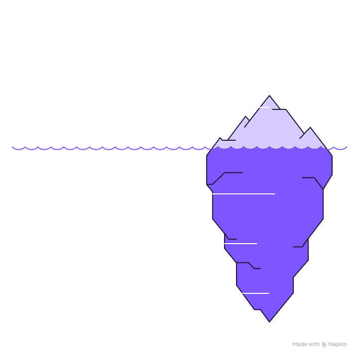
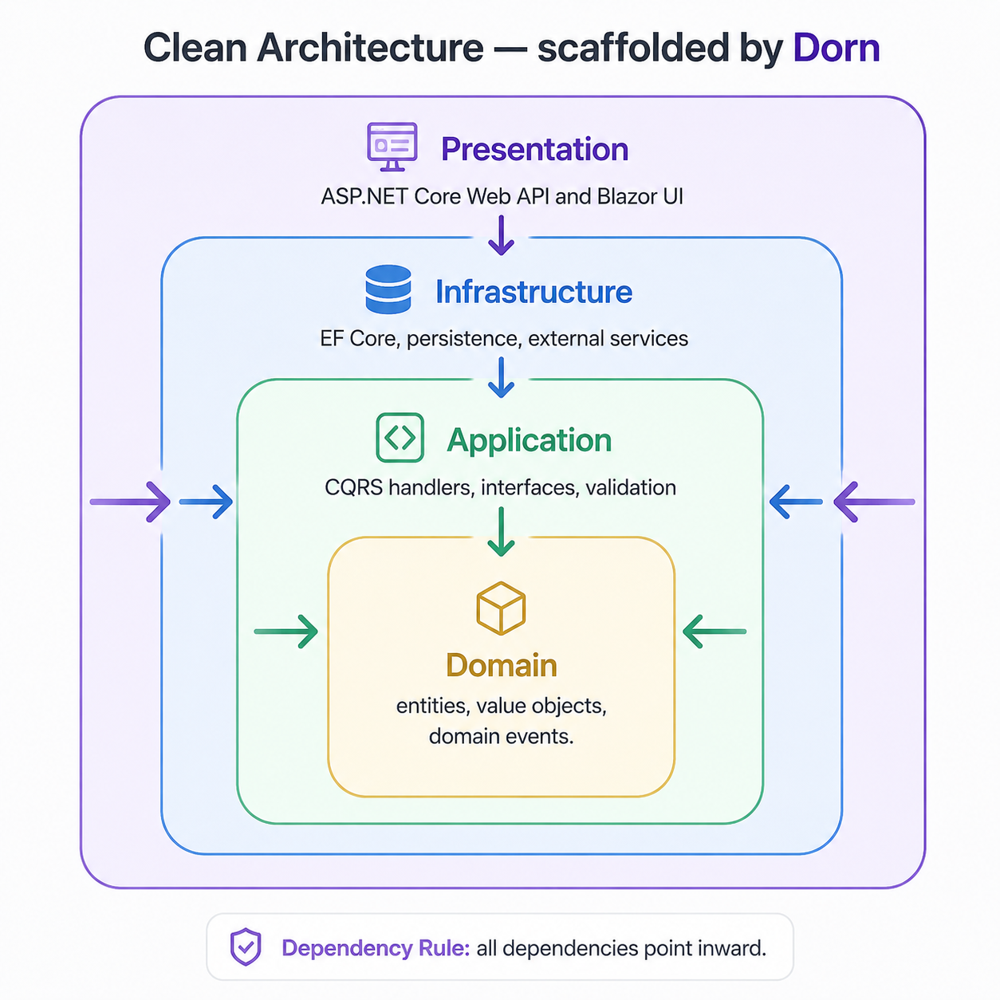

<!-- prettier-ignore -->
<div align="center">


# Dorn

**Scaffolding CLI para .NET con Clean Architecture real — no stubs, no placeholders.**

[](https://github.com/mbarretot/dorn/actions/workflows/ci.yml)
[](https://dotnet.microsoft.com/)
[](LICENSE)
[](https://www.nuget.org/packages/Dorn.Cli)
[](https://www.nuget.org/packages/Dorn.Templates.WebApi)
[](./docs/contributing.md)

:star: Si este proyecto te resulta útil, dejale una estrella — ayuda a que más gente lo encuentre.

[Por qué Dorn](#por-qué-dorn) • [Instalación](#instalación) • [Uso](#uso) • [Opciones](#opciones) • [Arquitectura](#arquitectura) • [Roadmap](#roadmap) • [Documentación](#documentación) • [Contribuir](#contribuir)

</div>

---

Dorn es una CLI de scaffolding para .NET que genera proyectos WebAPI listos para producción con **Clean Architecture**, **CQRS** y persistencia configurable (EF Core o Dapper). No genera un esqueleto vacío: cada capa está cableada de punta a punta desde el primer commit.

## Por qué Dorn

<p align="center">
  
</p>

Armar un proyecto .NET con Clean Architecture desde cero significa resolver, una y otra vez, las mismas decisiones: cómo separar capas sin acoplarlas, cómo cablear CQRS sin traer una librería con licencia comercial, qué ORM usar y cómo aislarlo del dominio, cómo estructurar cuatro tiers de tests, cómo hacer que todo compile junto desde el día uno.

`dorn new webapi MyApp` resuelve eso en un comando. Lo que ves es la punta del iceberg — debajo hay una arquitectura completa, no una plantilla a medio hacer.

- **Arquitectura limpia real** — Domain, Application, Infrastructure, WebApi completamente cableadas, con la regla de dependencias validada por tests (ArchUnitNET)
- **CQRS nativo** — Commands y Queries separados con un mediator pattern propio, MIT, sin depender de MediatR
- **ORM flexible** — EF Core o Dapper, elegís según tu caso de uso
- **Testing de cuatro tiers** — Unit, Integration, Architecture y Functional tests generados junto con el proyecto
- **CLI interactiva** — te pregunta por wizard las opciones que no pasaste como flags

## Instalación

```bash
dotnet tool install --global Dorn.Cli
```

El paquete publicado `Dorn.Cli` instala el ejecutable `dorn`.

## Uso

```bash
dorn new webapi MyApp
cd MyApp && dotnet build
```

O, opcionalmente, con el template publicado para `dotnet new`:

```bash
dotnet new install Dorn.Templates.WebApi
dotnet new dorn-webapi -n MyApp
```

### Verbos de conveniencia en el proyecto generado

Una vez generado, el proyecto incluye verbos que operan sobre él desde la raíz (o cualquier padre con `--project <path>`):

```bash
dorn test              # corre los 4 tiers (Unit / Integration / Architecture / Functional)
dorn test --tier unit  # un solo tier
dorn run               # auto-detecta AppHost → Aspire, docker-compose.yml → Compose, sino `dotnet run` plain
dorn coverage          # tests + cobertura + gate fijo al 80%
```

Las dos formas de invocación son equivalentes:

- **`dorn <verbo>`** — global tool (PATH).
- **`dotnet dorn <verbo>`** — local tool resuelta por `.config/dotnet-tools.json`, que `dorn new webapi` ya genera (pinned a `Dorn.Cli`, restaurado automáticamente).

Ver [docs/templates/webapi.md](./docs/templates/webapi.md) para detalles.

### Desarrollo local (desde source)

Los flujos con paquetes `.nupkg` locales y feeds bajo `./artifacts` son solo para contributors y desarrollo local; para uso publicado, instalá `Dorn.Cli` desde NuGet. Ver [Getting started](./docs/getting-started.md).

## Opciones

| Opción | Default | Descripción |
|---|---|---|
| `--orm` | `efcore` | ORM: `efcore` (EF Core con migraciones) o `dapper` (micro-ORM con SQL crudo) |
| `--database` | `sqlite` | Proveedor de base de datos: `sqlite` (zero-config) o `sqlserver` (contenedor vía Aspire) |
| `--orchestrator` | `aspire` | Orquestador: `aspire` o `docker-compose` |
| `-o`, `--output` | directorio actual | Carpeta de salida |
| `--force` | — | Sobrescribe si la carpeta no está vacía |
| `--no-restore` | — | Omite el `dotnet tool restore` automático post-generación |

### Ejemplos

```bash
# Stack completo: Dapper + SQL Server + Docker Compose
dorn new webapi MyApp --orm dapper --database sqlserver --orchestrator docker-compose

# Default: EF Core + SQLite + Aspire
dorn new webapi MyApp

# Minimal: EF Core + SQLite + sin orquestador
dorn new webapi MyApp --orchestrator none
```

## Arquitectura

<p align="center">
  
</p>

```
MyApp/
├── src/
│   ├── MyApp.Domain/           # Entities, domain events, repository interfaces
│   ├── MyApp.Application/      # Commands, queries, handlers (CQRS), DTOs
│   ├── MyApp.Infrastructure/   # Implementaciones EF Core o Dapper
│   └── MyApp.WebApi/           # Minimal API endpoints
└── tests/
    ├── MyApp.Application.Tests/     # Unit tests
    ├── MyApp.Architecture.Tests/    # Validación de capas (ArchUnitNET)
    ├── MyApp.Functional.Tests/      # HTTP endpoints (WebApplicationFactory)
    └── MyApp.Integration.Tests/     # Persistencia real (Testcontainers)
```

### Selección de ORM

| ORM | Cuándo usarlo | Características |
|---|---|---|
| **EF Core** | Default, migraciones automáticas, change tracking | `DbContext`, migrations, `SaveChanges` automático |
| **Dapper** | Máximo control, queries optimizadas, SQL crudo | Connection factory, queries explícitas, máximo rendimiento |

### Repository Pattern

El template implementa Repository Pattern en el dominio:

```
Domain/Common/Interfaces/
├── IRepository.cs          # Genérico: GetByIdAsync, Add, Update, Remove
├── IReadRepository.cs      # Solo lectura: GetAllAsync, FindAsync, AnyAsync
└── ITodoItemRepository.cs  # Específico de la entidad (extensible)

Infrastructure/Repositories/
├── EfCore/TodoItemRepository.cs   # Implementación EF Core
└── Dapper/TodoItemRepository.cs   # Implementación Dapper
```

## Technology Stack

- **.NET 10** con C# 13 (latest)
- **Microsoft.TemplateEngine.Edge** embebido (no toca el cache global de `dotnet new`)
- **Paquetes NuGet publicados** — `Dorn.Cli`, `Dorn.Templates.WebApi`, `Dorn.Messaging`, `Dorn.Messaging.Contracts` y `Dorn.SharedKernel`
- **Mediator pattern** propio, MIT (sin MediatR)
- **EF Core 10** o **Dapper 2.1** según la opción seleccionada
- **xUnit + NSubstitute + ArchUnitNET** para tests
- **Spectre.Console** para la CLI interactiva

## Features

- **Sin licencias comerciales** — mediator CQRS MIT, sin FluentAssertions ni Moq
- **Migraciones automáticas** — con EF Core (vía `dotnet ef migrations add`)
- **Soporte Docker** — Docker Compose o Aspire para desarrollo local
- **SQLite zero-config** — funciona out-of-the-box sin base de datos externa
- **Validación type-safe** — FluentValidation para commands y queries

## Roadmap

- [x] Template `webapi` — Clean Architecture, CQRS, EF Core/Dapper, 4 tiers de tests
- [ ] Template `ui` — placeholder en [`templates/ui/README.md`](./templates/ui/README.md)

Ver [ADRs](./docs/adr) para el detalle de cada decisión de arquitectura.

## Documentación

- [Getting started](./docs/getting-started.md)
- [WebAPI template reference](./docs/templates/webapi.md)
- [Architecture](./docs/architecture.md)
- [Architecture decisions (ADRs)](./docs/adr)
- [Contributing](./docs/contributing.md)

## Contribuir

Este proyecto acepta contribuciones. Ver [CONTRIBUTING](./docs/contributing.md) para guidelines, incluyendo cómo agregar un nuevo template.

## License

Este proyecto está bajo licencia MIT. Ver [LICENSE](./LICENSE) para más detalles.
