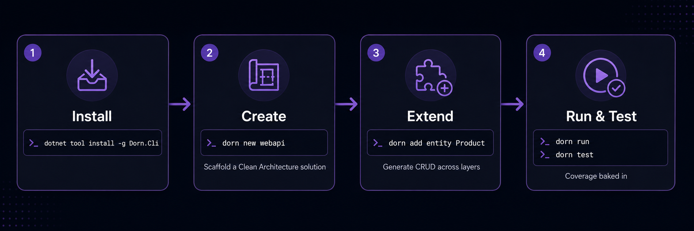

<!-- prettier-ignore -->
<div align="center">


# Dorn

[](https://github.com/mbarretot/dorn/actions/workflows/ci.yml)
[](https://dotnet.microsoft.com/)
[](LICENSE)
[](https://www.nuget.org/packages/Dorn.Templates.WebApi)

:star: If you like this project, star it on GitHub — it helps a lot!

[Overview](#overview) • [Get started](#getting-started) • [Options](#options) • [Architecture](#architecture) • [Documentation](#documentation) • [Contributing](#contributing)

</div>

.NET scaffolding CLI for Clean Architecture templates. Genera proyectos webapi listos para producción con arquitectura limpia, CQRS y persistencia configurable (EF Core o Dapper).

<p align="center">
  
</p>

## Overview

Dorn es una herramienta de scaffolding que genera proyectos .NET con Clean Architecture real — cuatro capas cableadas de punta a punta, no stubs ni placeholders.

Características principales:

- **Arquitectura limpia real** — Domain, Application, Infrastructure, WebApi completamente cableadas
- **CQRS nativo** — Commands y Queries separados con mediator pattern custom MIT (sin MediatR)
- **ORM flexible** — EF Core o Dapper, elegís según tu caso de uso
- **Testing completo** — Unit tests, Architecture tests (ArchUnitNET), Functional tests, Integration tests
- **CLI interactiva** — Opciones seleccionadas por wizard si no las pasás como flags

## Get started

### Instalación

```bash
dotnet new install Dorn.Templates.WebApi
```

### Uso básico

```bash
dorn new webapi MyApp
cd MyApp && dotnet build
```

O con `dotnet new`:

```bash
dotnet new dorn-webapi -n MyApp
```

### Desarrollo local (desde source)

```bash
dotnet tool install -g dorn
dorn new webapi MyApp
```

## Options

| Option | Default | Description |
|---|---|---|
| `--orm` | `efcore` | ORM: `efcore` (EF Core with migrations) or `dapper` (micro-ORM with raw SQL) |
| `--database` | `sqlite` | Database provider: `sqlite` (zero-config) or `sqlserver` (Aspire container) |
| `--orchestrator` | `aspire` | Orchestrator: `aspire` or `docker-compose` |
| `-o`, `--output` | current directory | Output folder |
| `--force` | — | Overwrite if folder is not empty |

### Examples

```bash
# Full stack: Dapper + SQL Server + Docker Compose
dorn new webapi MyApp --orm dapper --database sqlserver --orchestrator docker-compose

# Default: EF Core + SQLite + Aspire
dorn new webapi MyApp

# Minimal: EF Core + SQLite + no orchestrator
dorn new webapi MyApp --orchestrator none
```

## Architecture

### Clean Architecture Layers

<p align="center">
  
</p>

```
MyApp/
├── src/
│   ├── MyApp.Domain/           # Entities, domain events, repository interfaces
│   ├── MyApp.Application/     # Commands, queries, handlers (CQRS), DTOs
│   ├── MyApp.Infrastructure/  # EF Core or Dapper implementations
│   └── MyApp.WebApi/         # Minimal API endpoints
└── tests/
    ├── MyApp.Application.Tests/      # Unit tests
    ├── MyApp.Architecture.Tests/    # Layer validation (ArchUnitNET)
    ├── MyApp.Functional.Tests/      # HTTP endpoints (WebApplicationFactory)
    └── MyApp.Integration.Tests/     # Real persistence (Testcontainers)
```

### ORM Selection

| ORM | When to use | Features |
|---|---|---|
| **EF Core** | Default, auto migrations, change tracking | `DbContext`, migrations, `SaveChanges` automático |
| **Dapper** | Maximum control, optimized queries, raw SQL | Connection factory, explicit queries, maximum performance |

### Repository Pattern

El template implementa Repository Pattern en el dominio:

```
Domain/Common/Interfaces/
├── IRepository.cs          # Generic: GetByIdAsync, Add, Update, Remove
├── IReadRepository.cs      # Read-only: GetAllAsync, FindAsync, AnyAsync
└── ITodoItemRepository.cs  # Entity-specific (extensible)

Infrastructure/Repositories/
├── EfCore/TodoItemRepository.cs    # EF implementation
└── Dapper/TodoItemRepository.cs   # Dapper implementation
```

## Technology Stack

- **.NET 10** con C# 13 (latest)
- **Microsoft.TemplateEngine.Edge** embebido (no toca cache global de `dotnet new`)
- **Mediator pattern** custom MIT (sin MediatR)
- **EF Core 10** o **Dapper 2.1** según opción seleccionada
- **xUnit + NSubstitute + ArchUnitNET** para tests
- **Spectre.Console** para CLI interactiva

## Features

- **Sin licencias comerciales** — mediator CQRS MIT, sin FluentAssertions ni Moq
- **Migrations automáticas** — solo con EF Core (con `dotnet ef migrations add`)
- **Docker support** — Docker Compose o Aspire para desarrollo local
- **Zero-config SQLite** — funciona out-of-the-box sin base de datos externa
- **Type-safe validation** — FluentValidation para commands y queries

## Documentation

- [Getting started](./docs/getting-started.md)
- [WebAPI template reference](./docs/templates/webapi.md)
- [Architecture decisions](./docs/adr)
- [Contributing](./docs/contributing.md)

## Contributing

Este proyecto acepta contribuciones. Ver [CONTRIBUTING](./docs/contributing.md) para guidelines.

## License

Este proyecto está bajo licencia MIT. Ver [LICENSE](./LICENSE) para más detalles.
