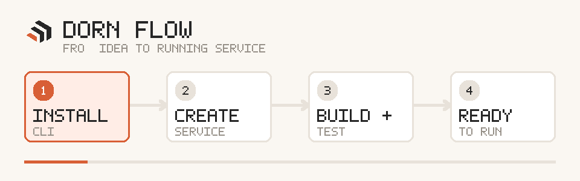

<!-- prettier-ignore -->
<div align="center">


# Dorn

**Production-ready .NET services, scaffolded in one command.**

Dorn generates Clean Architecture projects with CQRS, tests, and a CLI that runs them.

[](https://github.com/mbarretot/dorn/actions/workflows/ci.yml)
[](https://dotnet.microsoft.com/download/dotnet/10.0)

[Quick start](#-quick-start) · [Templates](#-choose-a-template) · [Commands](#-essential-commands) · [Documentation](#-go-deeper)

</div>

<p align="center">
  
</p>

## ⚡ Quick start

> [!NOTE]
> Use the .NET SDK pinned in [`global.json`](./global.json). Docker is optional unless your chosen setup needs containers.

```bash
dotnet tool install --global Dorn.Cli
dorn doctor
dorn new webapi MyApp
cd MyApp
dotnet build
dotnet dorn test
```

Want a guided setup? Run `dorn new webapi` in an interactive terminal and choose each option.

## 🧩 Choose a template

| Template | Best for | Configuration | Guide |
| --- | --- | --- | --- |
| `webapi` | HTTP APIs | ORM, database, orchestration, and authentication | [Open](./docs/templates/webapi.md) |
| `grpc` | gRPC services | Fixed EF Core, SQLite, and Aspire setup | [Open](./docs/templates/grpc.md) |
| `worker` | Jobs and scheduled work | Fixed EF Core, SQLite, and Aspire setup | [Open](./docs/templates/worker.md) |
| `blazor wasm` | Front-end apps | Theme (`slate`/`rose`) and playground toggle, fixed Aspire setup | [Open](./docs/templates/blazor-wasm.md) |

```bash
dorn new webapi MyApp --database postgres --orm dapper
dorn new grpc MyService
dorn new worker MyWorker
dorn new blazor wasm MyFrontend --theme rose
```

## ✨ Built in

- 🏛️ **Clean Architecture** with dependencies pointing inward
- 🔁 **CQRS** through Dorn's own MIT-licensed mediator
- 🧪 **Four test projects** for application, integration, architecture, and functional coverage
- 🛡️ **Architecture tests** that enforce layer boundaries
- 🧰 **Project operations** through one consistent CLI

## ⌨️ Essential commands

| Command | Purpose |
| --- | --- |
| `dorn new <template> <name>` | Generate a service |
| `dorn run` | Run through Aspire, Compose, or plain .NET |
| `dorn test` | Run all generated test tiers |
| `dorn coverage` | Run tests with the 80% coverage gate |
| `dorn doctor` | Check templates, .NET, and Docker readiness |

Run `dorn <command> --help` for options.

## 📚 Go deeper

| Goal | Documentation |
| --- | --- |
| Build Dorn locally | [Getting started](./docs/getting-started.md) |
| Understand the codebase | [Architecture](./docs/architecture.md) |
| Review technical decisions | [Architecture decision records](./docs/adr) |
| Improve Dorn | [Contributor guide](./docs/contributing.md) |
