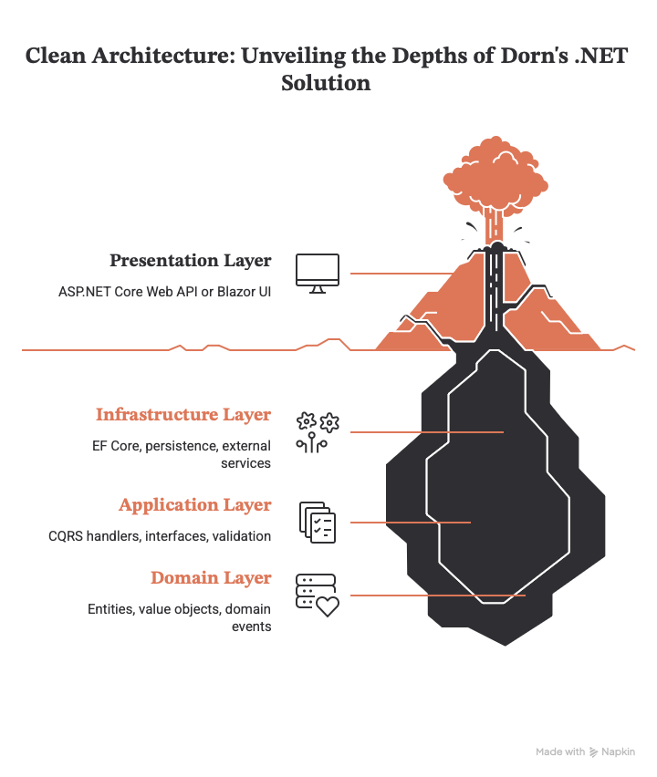

<!-- prettier-ignore -->
<div align="center">


# Dorn

**.NET scaffolding CLI with real Clean Architecture: no stubs, no placeholders.**

[](https://github.com/mbarretot/dorn/actions/workflows/ci.yml)
[](https://dotnet.microsoft.com/)
[](LICENSE)
[](https://www.nuget.org/packages/Dorn.Cli)
[](https://www.nuget.org/packages/Dorn.Templates.WebApi)
[](./docs/contributing.md)

[Quick start](#quick-start) • [Templates](#templates) • [Why Dorn](#why-dorn) • [Architecture](#architecture) • [CLI reference](#cli-reference) • [Documentation](#documentation)

</div>

---

> [!TIP]
> If this project is useful to you, leave a star. It helps more people find it.

Dorn is a .NET scaffolding CLI that generates production-ready services with **Clean Architecture**, **CQRS**, and configurable persistence. Every layer is wired end-to-end from the first commit, not an empty skeleton. It ships two templates: a full-featured **`webapi`** (REST, choice of ORM and database provider) and a scoped, minimal **`grpc`** service.

## Quick start

```bash
dotnet tool install --global Dorn.Cli
dorn new webapi MyApp
cd MyApp && dotnet build
```

Prefer not to install a global tool? `webapi` also ships as a standard `dotnet new` template. See [Alternative installation](./docs/templates/webapi.md#alternative-vanilla-dotnet-new-without-the-dorn-cli).

## Templates

|               | `webapi`                                               | `grpc`                                             |
| ------------- | ------------------------------------------------------ | -------------------------------------------------- |
| Generates     | REST API (ASP.NET Core Minimal APIs)                   | gRPC service (Protobuf)                            |
| Persistence   | EF Core or Dapper, your choice                         | EF Core (fixed)                                    |
| Database      | SQLite, SQL Server, or PostgreSQL                      | SQLite (fixed)                                     |
| Orchestration | Aspire, Docker Compose, or none                        | Aspire (fixed)                                     |
| Configuration | Flags or an interactive wizard                         | None (one fixed, opinionated MVP)                  |
| Reference     | [docs/templates/webapi.md](./docs/templates/webapi.md) | [docs/templates/grpc.md](./docs/templates/grpc.md) |

```bash
dorn new webapi MyApp --database postgres --orm dapper   # configurable
dorn new grpc MyService                                  # fixed scope, zero flags
```

`grpc` isn't a smaller `webapi`: it's a deliberately fixed MVP, so there's nothing to configure and nothing that can drift from a known-good combination. See the [scope rationale](./docs/templates/grpc.md#scope-a-fixed-mvp-not-a-smaller-webapi) if you're deciding which one fits your project.

## Why Dorn

<p align="center">
  
</p>

Building a Clean Architecture project from scratch means re-solving the same problems every time: separating layers without coupling them, wiring CQRS without a commercially-licensed dependency, isolating the ORM from the domain, structuring tests across four tiers, making it all compile together on day one. `dorn new webapi MyApp` resolves that in one command. What you see is the tip of the iceberg.

- **No commercial licenses anywhere**: a from-scratch, MIT-licensed CQRS mediator (no MediatR), xUnit + NSubstitute for tests (no FluentAssertions, no Moq)
- **The dependency rule is enforced, not just documented**: ArchUnitNET tests fail the build if a layer imports something it shouldn't
- **Four test tiers generated with the project**: Application, Integration, Architecture, and Functional, not left as an exercise for you
- **Zero-config by default**: SQLite needs no external database; Aspire needs no Docker to get started
- **CI from the first push**: every generated project ships a working GitHub Actions workflow and a pinned `global.json`

## Architecture

```
MyApp/
├── src/
│   ├── MyApp.Domain/           # Entities, domain events, repository interfaces
│   ├── MyApp.Application/      # Commands, queries, handlers (CQRS), DTOs
│   ├── MyApp.Infrastructure/   # EF Core or Dapper implementations
│   └── MyApp.WebApi/           # Minimal API endpoints
└── tests/
    ├── MyApp.Application.Tests/     # Unit tests
    ├── MyApp.Architecture.Tests/    # Layering validation (ArchUnitNET)
    ├── MyApp.Functional.Tests/      # HTTP endpoints (WebApplicationFactory)
    └── MyApp.Integration.Tests/     # Real persistence (Testcontainers)
```

Dependencies point strictly inward: `WebApi` depends on `Application`, `Infrastructure` implements interfaces `Application` defines, and `Domain` depends on nothing. `Infrastructure` ships both a Repository Pattern (`IRepository`, `IReadRepository`) and its EF Core and Dapper implementations side by side, so switching `--orm` is a generation-time choice, not a rewrite. See [docs/architecture.md](./docs/architecture.md) for the full breakdown, including the CLI's own architecture.

## CLI reference

Every generated project ships verbs to operate on itself, from its root (or any parent, with `--project <path>`):

| Command         | Does                                                                                   |
| --------------- | -------------------------------------------------------------------------------------- |
| `dorn test`     | Runs all 4 tiers (`--tier` to filter to one)                                           |
| `dorn run`      | Auto-detects AppHost → Aspire, `docker-compose.yml` → Compose, else plain `dotnet run` |
| `dorn coverage` | Runs tests with coverage, gated at a fixed 80%                                         |

`dorn <verb>` (global tool) and `dotnet dorn <verb>` (local tool, resolved via the `.config/dotnet-tools.json` every generated project already includes) are equivalent.

`webapi`'s generation-time flags (`--orm`, `--database`, `--orchestrator`, and the rest) are documented in full in the [template reference](./docs/templates/webapi.md), including every supported combination.

## Roadmap

- [x] `webapi`: Clean Architecture, CQRS, EF Core/Dapper, 4 test tiers
- [x] `grpc`: Clean Architecture, CQRS, fixed EF Core/SQLite/Aspire MVP
- [ ] `ui`: placeholder at [`templates/ui/README.md`](./templates/ui/README.md)

Every architectural decision behind these is recorded in [`docs/adr`](./docs/adr).

## Documentation

- [Getting started](./docs/getting-started.md): local development, from source
- [`webapi` template reference](./docs/templates/webapi.md)
- [`grpc` template reference](./docs/templates/grpc.md)
- [Architecture](./docs/architecture.md): how Dorn itself is built
- [Architecture decisions (ADRs)](./docs/adr)
- [Contributing](./docs/contributing.md)
