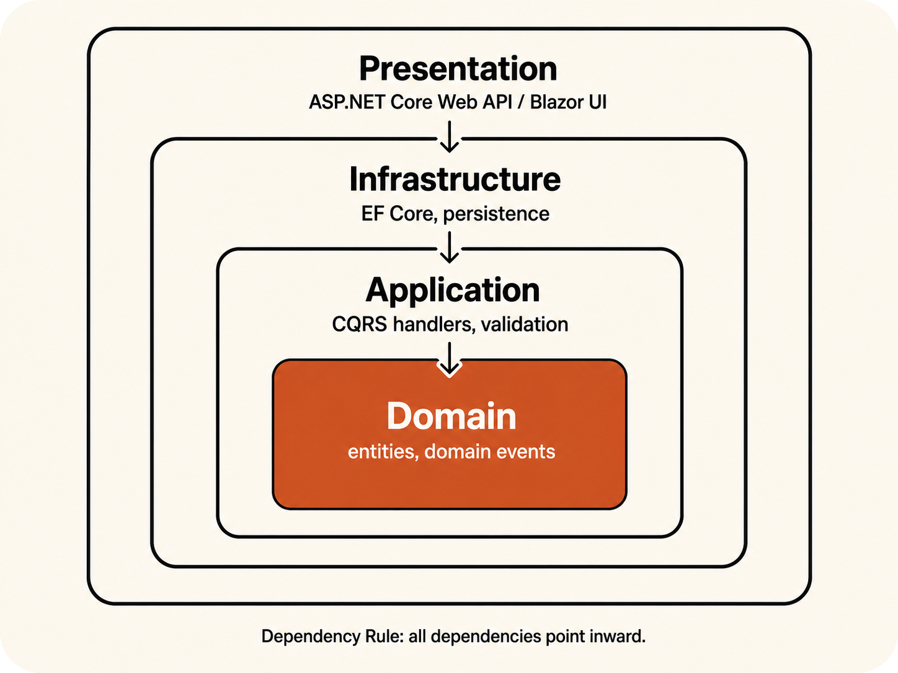

<!-- prettier-ignore -->
<div align="center">


# Dorn

**.NET scaffolding CLI with real Clean Architecture — no stubs, no placeholders.**

[](https://github.com/mbarretot/dorn/actions/workflows/ci.yml)
[](https://dotnet.microsoft.com/)
[](LICENSE)
[](https://www.nuget.org/packages/Dorn.Cli)
[](https://www.nuget.org/packages/Dorn.Templates.WebApi)
[](./docs/contributing.md)

[Why Dorn](#why-dorn) • [Installation](#installation) • [Usage](#usage) • [Options](#options) • [Architecture](#architecture) • [Roadmap](#roadmap) • [Documentation](#documentation)

</div>

---

> [!TIP]
> If this project is useful to you, leave a star — it helps more people find it.

Dorn is a .NET scaffolding CLI that generates production-ready projects with **Clean Architecture**, **CQRS**, and configurable persistence. It doesn't generate an empty skeleton: every layer is wired end-to-end from the first commit. It ships two templates: **`webapi`** (full REST API, ORM and database provider of your choice) and **`grpc`** (gRPC service, fixed and minimal scope).

## Why Dorn

<p align="center">
  
</p>

Building a .NET project with Clean Architecture from scratch means solving the same decisions over and over: how to separate layers without coupling them, how to wire CQRS without pulling in a commercially-licensed library, which ORM to use and how to isolate it from the domain, how to structure four test tiers, how to make it all compile together from day one.

`dorn new webapi MyApp` solves that in one command. What you see is the tip of the iceberg — underneath is a complete architecture, not a half-finished template.

- **Real Clean Architecture** — Domain, Application, Infrastructure, WebApi/Grpc fully wired, with the dependency rule validated by tests (ArchUnitNET)
- **Native CQRS** — Commands and Queries separated with a custom, MIT-licensed mediator pattern, no MediatR dependency
- **Flexible ORM** (`webapi` template) — EF Core or Dapper, pick based on your use case
- **Four-tier testing** — Application, Integration, Architecture, and Functional tests generated alongside the project
- **Interactive CLI** — the `webapi` template prompts via wizard for any option you didn't pass as a flag

## Installation

```bash
dotnet tool install --global Dorn.Cli
```

The published `Dorn.Cli` package installs the `dorn` executable.

## Usage

```bash
dorn new webapi MyApp
cd MyApp && dotnet build
```

Or, optionally, with the template published for `dotnet new`:

```bash
dotnet new install Dorn.Templates.WebApi
dotnet new dorn-webapi -n MyApp
```

For a gRPC service instead of REST, the `grpc` template generates the same kind of architecture with a fixed scope (EF Core + SQLite + Aspire, no configuration flags):

```bash
dorn new grpc MyService
```

See the [gRPC template reference](./docs/templates/grpc.md) for the full detail.

### Convenience verbs in the generated project

Once generated, the project ships verbs that operate on it from the root (or any parent, with `--project <path>`):

```bash
dorn test              # runs all 4 tiers (Application / Integration / Architecture / Functional)
dorn test --tier unit  # a single tier
dorn run               # auto-detects AppHost → Aspire, docker-compose.yml → Compose, else plain `dotnet run`
dorn coverage          # tests + coverage + a fixed 80% gate
```

Both invocation forms are equivalent:

- **`dorn <verb>`** — global tool (PATH).
- **`dotnet dorn <verb>`** — local tool resolved via `.config/dotnet-tools.json`, which `dorn new webapi`/`dorn new grpc` already generates (pinned to `Dorn.Cli`, restored automatically).

See [docs/templates/webapi.md](./docs/templates/webapi.md) for details.

> [!NOTE]
> Workflows using local `.nupkg` packages and feeds under `./artifacts` are for contributors and local development only; for published use, install `Dorn.Cli` from NuGet. See [Getting started](./docs/getting-started.md).

## Options

Flags for the `webapi` template (the `grpc` template exposes no configuration flags — its scope is fixed, see [its reference](./docs/templates/grpc.md)):

| Option | Default | Description |
|---|---|---|
| `--orm` | `efcore` | ORM: `efcore` (EF Core with migrations) or `dapper` (micro-ORM with raw SQL) |
| `--database` | `sqlite` | Database provider: `sqlite` (zero-config), `sqlserver`, or `postgres` (both via an Aspire-managed container) |
| `--orchestrator` | `aspire` | Orchestrator: `aspire`, `docker-compose`, or `none` |
| `-o`, `--output` | current directory | Output folder |
| `--force` | — | Overwrite if the folder isn't empty |
| `--no-restore` | — | Skip the automatic post-generation `dotnet tool restore` |

### Examples

```bash
# Full stack: Dapper + SQL Server + Docker Compose
dorn new webapi MyApp --orm dapper --database sqlserver --orchestrator docker-compose

# PostgreSQL via Aspire
dorn new webapi MyApp --database postgres

# Default: EF Core + SQLite + Aspire
dorn new webapi MyApp

# Minimal: EF Core + SQLite, no orchestrator
dorn new webapi MyApp --orchestrator none
```

## Architecture

<p align="center">
  
</p>

```
MyApp/
├── src/
│   ├── MyApp.Domain/           # Entities, domain events, repository interfaces
│   ├── MyApp.Application/      # Commands, queries, handlers (CQRS), DTOs
│   ├── MyApp.Infrastructure/   # EF Core or Dapper implementations
│   └── MyApp.WebApi/           # Minimal API endpoints
└── tests/
    ├── MyApp.Application.Tests/     # Unit tests
    ├── MyApp.Architecture.Tests/    # Layering validation (ArchUnitNET)
    ├── MyApp.Functional.Tests/      # HTTP endpoints (WebApplicationFactory)
    └── MyApp.Integration.Tests/     # Real persistence (Testcontainers)
```

### ORM selection

| ORM | When to use it | Characteristics |
|---|---|---|
| **EF Core** | Default, automatic migrations, change tracking | `DbContext`, migrations, automatic `SaveChanges` |
| **Dapper** | Maximum control, optimized queries, raw SQL | Connection factory, explicit queries, maximum throughput |

### Repository Pattern

The template implements the Repository Pattern in the domain:

```
Domain/Common/Interfaces/
├── IRepository.cs          # Generic: GetByIdAsync, Add, Update, Remove
├── IReadRepository.cs      # Read-only: GetAllAsync, FindAsync, AnyAsync
└── ITodoItemRepository.cs  # Entity-specific (extensible)

Infrastructure/Repositories/
├── EfCore/TodoItemRepository.cs   # EF Core implementation
└── Dapper/TodoItemRepository.cs   # Dapper implementation
```

## Technology Stack

- **.NET 10** with C# 13 (latest)
- **Microsoft.TemplateEngine.Edge** embedded (doesn't touch the global `dotnet new` cache)
- **Published NuGet packages** — `Dorn.Cli`, `Dorn.Templates.WebApi`, `Dorn.Messaging`, `Dorn.Messaging.Contracts`, and `Dorn.SharedKernel`
- **Custom mediator pattern**, MIT-licensed (no MediatR)
- **EF Core 10** or **Dapper 2.1**, depending on the selected option (`webapi` template)
- **gRPC + Protobuf**, hosted with **.NET Aspire** (`grpc` template)
- **xUnit + NSubstitute + ArchUnitNET** for tests
- **Spectre.Console** for the interactive CLI

## Features

- **No commercial licenses** — MIT CQRS mediator, no FluentAssertions or Moq
- **Automatic migrations** — with EF Core (via `dotnet ef migrations add`)
- **Docker support** — Docker Compose or Aspire for local development
- **Zero-config SQLite** — works out of the box, no external database
- **Type-safe validation** — FluentValidation for commands and queries
- **CI ready to go** — every generated project ships a GitHub Actions workflow (`.github/workflows/ci.yml`) and a `global.json` with the SDK pinned, ready from the first push

## Roadmap

- [x] `webapi` template — Clean Architecture, CQRS, EF Core/Dapper, 4 test tiers
- [x] `grpc` template — Clean Architecture, CQRS, EF Core/SQLite, Aspire (fixed scope, no `--database`/`--orm`/`--orchestrator`)
- [ ] `ui` template — placeholder at [`templates/ui/README.md`](./templates/ui/README.md)

See the [ADRs](./docs/adr) for the detail behind each architecture decision.

## Documentation

- [Getting started](./docs/getting-started.md)
- [WebAPI template reference](./docs/templates/webapi.md)
- [gRPC template reference](./docs/templates/grpc.md)
- [Architecture](./docs/architecture.md)
- [Architecture decisions (ADRs)](./docs/adr)
- [Contributing](./docs/contributing.md)
