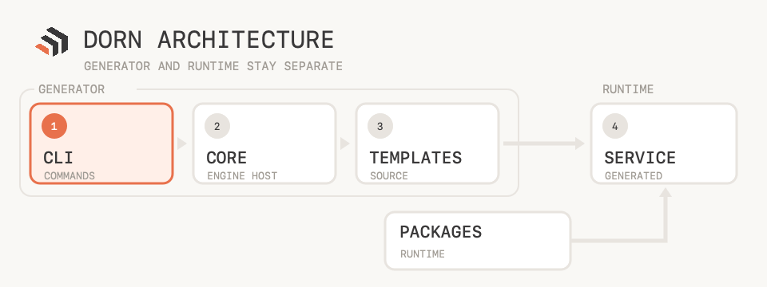

# Architecture

Dorn has one job: turn a template into a self-contained .NET service without coupling the generator to the generated runtime.

  

## 🧭 System map

| Area | Responsibility | Depends on |
| --- | --- | --- |
| `src/Dorn.Abstractions` | Generation and template contracts | BCL only |
| `src/Dorn.Core` | Template discovery, validation, and instantiation | Abstractions + Template Engine |
| `src/Dorn.Cli` | Commands, prompts, output, and project operations | Core + Abstractions |
| `templates/` | Source for generated Web API, gRPC, and worker services, plus front-end-only Blazor WebAssembly and Blazor Server apps | Published Dorn packages |
| `packages/` | CQRS contracts, mediator runtime, and DDD primitives | Contracts point inward |

The dependency rule is deliberate: Template Engine details stop at `Dorn.Core`, while generated projects never reference `src/`.

## ⚙️ Generation path

1. `Dorn.Cli` validates the command and builds a `GenerationRequest`.
2. `Dorn.Core` discovers templates through an isolated host under `~/.dorn/template-engine`.
3. `TemplateEngineGenerationEngine` instantiates the selected template and maps the result to Dorn contracts.
4. The generated project restores its pinned `Dorn.*` packages and runs independently.

> [!IMPORTANT]
> Dorn checks non-empty output directories before instantiation. Files are overwritten only when `--force` is explicit.

## 📦 Runtime packages

| Package | Owns | Dependency |
| --- | --- | --- |
| `Dorn.Messaging.Contracts` | Requests, handlers, behaviors, notifications, sender, publisher | None |
| `Dorn.Messaging` | Mediator and DI assembly scanning | Messaging.Contracts |
| `Dorn.SharedKernel` | `Entity`, `AggregateRoot`, `Result` | Messaging.Contracts |
| `Dorn.WebUI.Primitives` | Class merging, roving-focus/typeahead state, `UiId`, value-component base types, JS interop wrappers, theme state | ASP.NET Core Components, JSInterop |

Packages are the canonical source. Templates consume them through `PackageReference`, so shared code cannot drift between templates.

## 🏛️ Generated service boundaries

| Layer | May depend on | Must not depend on |
| --- | --- | --- |
| Domain | Shared kernel and contracts | Application, Infrastructure, host |
| Application | Domain and messaging contracts | Infrastructure, host |
| Infrastructure | Application and Domain | Host presentation concerns |
| Host | All inner layers for composition | Nothing points back to it |

The presentation changes by template, but the dependency direction does not:

- **Web API** maps Minimal API endpoints to requests.
- **gRPC** maps proto services to the same request model.
- **Worker** dispatches requests from a timer tick.
- **Blazor WebAssembly** has no backend at all — Domain/Application/Infrastructure/Host do not
  apply; its own boundary is `Components/Ui/` (design system) never depending on `Features/`
  (app code), enforced by its Architecture test tier.
- **Blazor Server** shares the same front-end-only boundary and `Components/Ui/`-vs-`Features/`
  rule as WebAssembly, plus a Server-only fitness function confining JS interop calls to
  `OnAfterRenderAsync`/`DisposeAsync`, since a real server process makes prerendering-time interop
  a genuine failure mode WASM never has.

## 🔁 Messaging rules

- The first registered `IPipelineBehavior<,>` is the outermost behavior and runs first.
- `Mediator.Send` resolves one matching request handler.
- `Mediator.Publish` invokes every matching notification handler sequentially.
- Aggregate roots raise domain events; Infrastructure publishes them only after persistence succeeds.

## 🧱 Template invariants

- Every template owns its nearest `Directory.Build.props` and `Directory.Packages.props`.
- Generated solutions must build outside this repository.
- Web API options are composed at generation time. gRPC, worker, Blazor WebAssembly, and Blazor Server intentionally use fixed MVP profiles.
- `templates/tests` proves generation and standalone compilation from a temporary directory.

## 📚 Decision trail

| Topic | Record |
| --- | --- |
| Embedded Template Engine | [ADR 0002](./adr/0002-embed-template-engine-edge.md) |
| Custom mediator | [ADR 0003](./adr/0003-custom-mediator-instead-of-mediatr.md) |
| Shared NuGet packages | [ADR 0010](./adr/0010-extract-messaging-and-shared-kernel-as-nuget-packages.md) |
| Four-tier testing | [ADR 0012](./adr/0012-four-tier-test-strategy.md) |
| Tailwind CLI acquisition | [ADR 0021](./adr/0021-tailwind-standalone-cli.md) |
| Copy-owned UI components | [ADR 0022](./adr/0022-copy-owned-ui-components.md) |
| Blazor WASM scoped MVP | [ADR 0023](./adr/0023-blazor-wasm-scoped-mvp.md) |
| Blazor Server scoped MVP | [ADR 0024](./adr/0024-blazor-server-scoped-mvp.md) |
| Template guides | [Web API](./templates/webapi.md) · [gRPC](./templates/grpc.md) · [Worker](./templates/worker.md) · [Blazor WASM](./templates/blazor-wasm.md) · [Blazor Server](./templates/blazor-server.md) |
