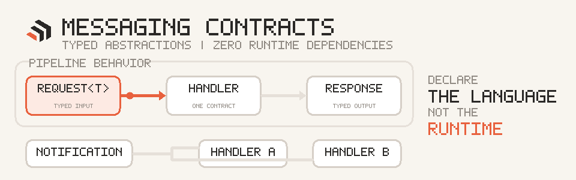

<!-- prettier-ignore -->
<div align="center">


# Dorn.Messaging.Contracts

**Zero-dependency CQRS and notification contracts for Domain and Application layers.**

</div>

<p align="center">
  
</p>

## ⚡ Install

```bash
dotnet add package Dorn.Messaging.Contracts
```

## 🧩 API at a glance

| Contract | Purpose |
| --- | --- |
| `IRequest<TResponse>` | Command or query returning a value |
| `IRequest` | Command returning `Unit` |
| `IRequestHandler<,>` | Handles one request type |
| `ISender` | Sends a request to its handler |
| `INotification` | Domain or integration event |
| `INotificationHandler<>` | Handles one notification type |
| `IPublisher` | Publishes to every registered handler |
| `IPipelineBehavior<,>` | Wraps request handling with cross-cutting behavior |

## 🚀 Quick example

```csharp
public sealed record CreateTodoCommand(string Title) : IRequest<Guid>;

public sealed class CreateTodoHandler : IRequestHandler<CreateTodoCommand, Guid>
{
    public Task<Guid> Handle(CreateTodoCommand request, CancellationToken ct)
    {
        var id = Guid.NewGuid();
        return Task.FromResult(id);
    }
}

public sealed record TodoCreated(Guid Id) : INotification;
```

Use [`Dorn.Messaging`](../Dorn.Messaging/README.md) for dispatch, handler discovery, and pipeline execution.
