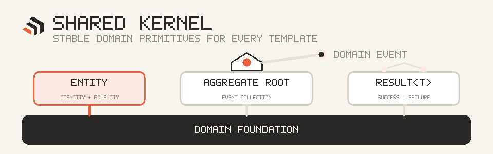

<!-- prettier-ignore -->
<div align="center">


# Dorn.SharedKernel

**Minimal DDD primitives shared by Dorn templates.**

</div>

<p align="center">
  
</p>

## ⚡ Install

```bash
dotnet add package Dorn.SharedKernel
```

## 🧩 Building blocks

| Type | Purpose |
| --- | --- |
| `Entity` | Identity-based equality for the same type and `Id` |
| `AggregateRoot` | Entity with a protected domain-event collector |
| `Result` | Success or failure without an expected exception |
| `Result<T>` | Success value or failure error |

## 🚀 Quick example

```csharp
public sealed class TodoItem : AggregateRoot
{
    public string Title { get; private set; } = string.Empty;

    public static Result<TodoItem> Create(string title)
    {
        if (string.IsNullOrWhiteSpace(title))
            return Result.Failure<TodoItem>("Title is required.");

        var item = new TodoItem { Title = title };
        item.AddDomainEvent(new TodoCreated(item.Id));
        return Result.Success(item);
    }
}
```

> [!CAUTION]
> `Result<T>.Value` throws for a failed result. Check `IsSuccess` or `IsFailure` first.

Domain events implement `INotification` from [`Dorn.Messaging.Contracts`](../Dorn.Messaging.Contracts/README.md).
